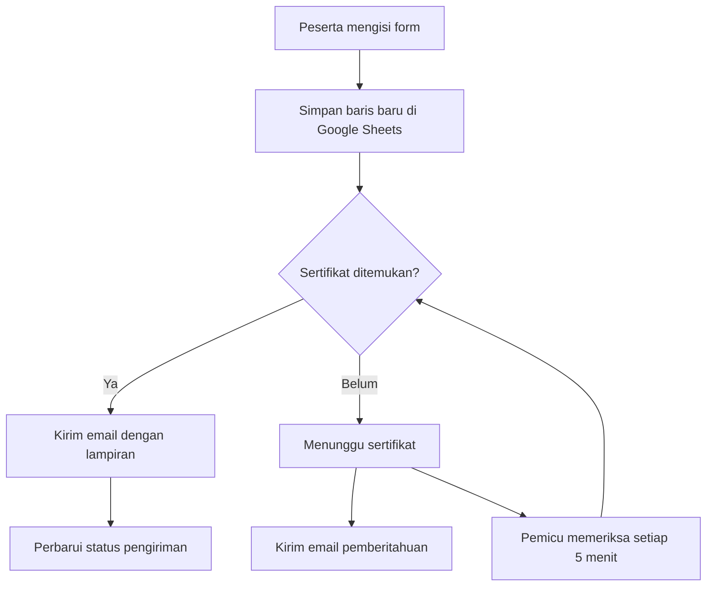

<div align="center">
  

  <h1>Presensi Seminar Kewirausahaan</h1>
  <p><strong>Isi presensi. Simpan ke rekap. Terima sertifikat.</strong></p>
  <p>Website presensi mahasiswa dan peserta umum dengan rekap Google Sheets serta pengiriman sertifikat melalui email.</p>

  <p>
    <a href="https://s.id/SemKWU26"><strong>Buka Form Presensi</strong></a>
    &nbsp; &middot; &nbsp;
    <a href="https://javamaulana.github.io/Presensi-Seminar/">Website GitHub Pages</a>
    &nbsp; &middot; &nbsp;
    <a href="apps-script/UPDATE.md">Panduan Panitia</a>
  </p>

  <p><code>HTML / CSS / JavaScript</code> &nbsp; <code>Google Apps Script</code> &nbsp; <code>GitHub Pages</code></p>
</div>

---

## Sekilas

Peserta memilih kategori, mengisi identitas dan email, lalu mengirim presensi. Backend menyimpan data **sebelum** mencari atau mengirim sertifikat, sehingga masalah sertifikat tidak membatalkan pencatatan presensi.

| Fitur | Cara kerja |
| --- | --- |
| Mahasiswa Kewirausahaan | Pilih kelas dan nama; NIM terisi otomatis. |
| Peserta umum | Pilih nama terdaftar atau isi nama dan NIM/identitas secara manual. |
| Rekap lengkap | Setiap pengiriman menjadi baris baru, termasuk ketika email yang digunakan sama. |
| Sertifikat tersedia | File dari Google Drive dikirim sebagai lampiran email. |
| Sertifikat belum tersedia | Presensi masuk antrean dan email pemberitahuan 1x24 jam dikirim jika layanan email berhasil. |
| Pengiriman susulan | Setelah pemicu diaktifkan, antrean diperiksa setiap 5 menit. |
| Konfirmasi penyimpanan | Form membaca respons backend dan mempertahankan isian jika penyimpanan belum terkonfirmasi. |

> Daftar peserta umum di `script.js` belum tersinkron otomatis dengan Google Sheet pendaftaran. Panitia dapat memperbarui `GENERAL_PARTICIPANTS`; peserta di luar daftar dapat menggunakan pilihan isi manual.

## Alur presensi



## Setup untuk panitia

### 1. Siapkan rekap dan folder sertifikat

- Buka Google Sheet rekap, lalu **Ekstensi > Apps Script**.
- Salin [apps-script/Code.gs](apps-script/Code.gs) ke editor Apps Script.
- Isi `CERTIFICATE_FOLDER_ID` dengan ID folder sertifikat yang digunakan. Saat memperbarui kode, pertahankan ID folder aktif.
- Simpan, pilih fungsi **`setupAttendance`**, lalu klik **Run**. Fungsi ini menghubungkan spreadsheet dan menyiapkan tab **Presensi**.

Simpan sertifikat langsung di folder tersebut, bukan subfolder. Nama file harus memuat nama lengkap peserta; tambahkan NIM untuk membantu membedakan nama yang mirip.

```text
Sertifikat - 2410432045 - Mutiara Aviva.pdf
```

### 2. Aktifkan backend

- Buat deployment **Web app** dengan **Execute as: Me** dan akses **Anyone**.
- Salin URL berakhiran `/exec` ke `CONFIG.appsScriptUrl` di [script.js](script.js).
- Untuk proyek yang sudah aktif, gunakan **Deploy > Manage deployments > pensil > New version > Deploy** agar URL lama tetap digunakan.
- Buka URL `/exec` untuk memeriksa versi backend:

```json
{"ok":true,"version":"attendance-append-v3"}
```

### 3. Aktifkan pengiriman otomatis

Pilih **`setupAutomaticCertificates`** di editor, klik **Run**, lalu setujui izin Google. Pasang dari satu akun panitia. Pastikan menu **Triggers / Pemicu** memuat `sendPendingCertificates` setiap 5 menit.

Setelah itu, panitia cukup mengunggah file sertifikat. Peserta yang sudah berstatus **Menunggu sertifikat** tidak perlu mengisi ulang. Untuk memproses antrean langsung, jalankan **`sendPendingCertificates`**; fungsi ini benar-benar mengirim email.

### 4. Publikasikan website

Frontend proyek ini menggunakan **GitHub Pages** dari branch `main`, folder `/(root)`. Tidak diperlukan proses build. Pengaturan hosting dijelaskan di [panduan GitHub Pages](GITHUB_PAGES_SETUP.md).

> **Deployment website dan backend terpisah.** Push ke GitHub memperbarui frontend, tetapi kode Google Apps Script perlu disalin dan dideploy melalui editor Google.

## Membaca status rekap

| Status di tab Presensi | Makna dan tindak lanjut |
| --- | --- |
| **Menunggu sertifikat** | Presensi tersimpan; sistem menunggu file atau kesempatan pemrosesan berikutnya. Jika berlarut, cek nama file, akses folder, kuota, dan log eksekusi. |
| **Terkirim** | Backend selesai mengirim email sertifikat saat presensi masuk. |
| **Terkirim otomatis** | Pemroses antrean selesai mengirim email sertifikat. |
| **Perlu cek pengiriman** | Pengiriman dimulai tetapi belum terkonfirmasi selesai di rekap. Periksa log dan penerimaan email sebelum mencoba ulang. |

**Setiap pengisian ulang tetap menjadi baris baru.** Ini menjaga riwayat, tetapi beberapa pengisian ulang dapat menghasilkan beberapa email. Pembaruan kode tidak memulihkan baris yang sudah tertimpa oleh versi lama.

Panduan penanganan error, aktivasi ulang, dan pemeriksaan deployment tersedia di [apps-script/UPDATE.md](apps-script/UPDATE.md).

## Struktur proyek

| File / folder | Fungsi |
| --- | --- |
| [index.html](index.html) | Struktur halaman dan form presensi. |
| [styles.css](styles.css) | Tampilan dan tata letak website. |
| [script.js](script.js) | Daftar peserta, validasi, dan komunikasi dengan backend. |
| [assets/](assets/) | Aset visual website. |
| [apps-script/Code.gs](apps-script/Code.gs) | Pencatatan presensi, pencarian sertifikat, dan pengiriman email. |
| [apps-script/UPDATE.md](apps-script/UPDATE.md) | Panduan operasional dan pembaruan backend. |
| [tests/](tests/) | Pengujian form, rekap, respons server, dan antrean sertifikat. |

## Pengujian lokal

Jalankan dari direktori proyek menggunakan Node.js:

```bash
node tests/presensi.cjs
node tests/automatic-certificates.cjs
node tests/submit-response.cjs
```

Pengujian memakai simulasi layanan Google dan **tidak mengirim email sungguhan**. Setelah deployment, lakukan uji dengan email panitia dan periksa tab Presensi, kotak masuk, serta spam.

<details>
<summary><strong>Catatan operasional</strong></summary>

- Pengecekan 5 menit bukan jaminan waktu pengiriman tepat; akses Google, kuota email, dan ketersediaan file memengaruhi hasilnya.
- Panitia tetap perlu menyiapkan sertifikat tepat waktu untuk memenuhi pemberitahuan 1x24 jam.
- Status terkirim berarti pemanggilan layanan email selesai, bukan bukti pesan sudah dibaca atau masuk kotak utama penerima.
- Daftar peserta dalam frontend dapat dilihat publik. Jangan menyimpan password, token rahasia, atau isi rekap presensi di repository publik.
- Jika form belum mendapat konfirmasi, cek rekap sebelum mengirim ulang.

</details>

---

<p align="center"><strong>Seminar Kewirausahaan</strong><br>Presensi dan sertifikat dalam satu alur.</p>
